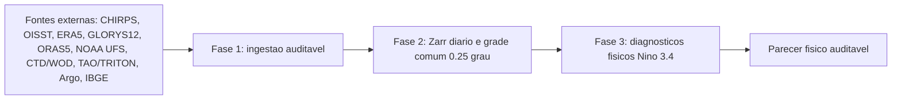

# NINO-BRASIL

Projeto Python para diagnosticar fisicamente o aquecimento do Pacifico equatorial no Nino 3.4 usando SST/OISST local, memoria subsuperficial e indicadores oceanograficos ate a Fase 3.

Este README e a porta de entrada do projeto. Os documentos longos ficam em `docs/`; o status local vivo fica em `painel_executivo.md`.

## Leia Primeiro

| Necessidade | Arquivo | Uso |
|---|---|---|
| Status executivo local | [painel_executivo.md](painel_executivo.md) | Painel gerado automaticamente com cobertura de dados, lacunas e proximo comando recomendado. |
| Fluxo, metodos e outputs | [docs/ARQUITETURA.md](docs/ARQUITETURA.md) | Desenho executivo do pipeline, metodos, micro-metodos e proposito de cada produto. |
| Comandos de download | [docs/RUNBOOK_DOWNLOADS.md](docs/RUNBOOK_DOWNLOADS.md) | Sequencia operacional para CHIRPS, OISST, ERA5, oceano diario, CTD/WOD e validacao in situ. |
| Oceano originalmente diario | [docs/RUNBOOK_OCEAN_DAILY.md](docs/RUNBOOK_OCEAN_DAILY.md) | Fontes, contrato cientifico, numero de requisicoes e retomada UFS/GLORYS12. |
| Fechamento da Fase 2 oceanica | [docs/RUNBOOK_FASE2_OCEANO.md](docs/RUNBOOK_FASE2_OCEANO.md) | Execucao completa UFS, GLORYS/GLO12, ORAS5 mensal e auditorias. |
| Fase 3 fisica | [docs/FASE3_RECOMENDACOES.md](docs/FASE3_RECOMENDACOES.md) | Diagnostico fisico Nino 3.4 com OISST local, eventos derivados da propria SST, subsuperficie, DHW e Kelvin. |
| Metodologia cientifica | [docs/METODOLOGIA.md](docs/METODOLOGIA.md) | Regras de climatologia, anomalias, diagnosticos fisicos e auditoria ate a Fase 3. |
| Fontes de dados | [docs/DATA_SOURCES.md](docs/DATA_SOURCES.md) | Variaveis, dominios, caminhos de raw/interim/processed e politica de armazenamento. |
| Pareceres e paineis | [docs/PARECERES](docs/PARECERES) | Pareceres tecnicos recebidos e paineis descritivos derivados deles. |
| Documentos historicos | [docs/LEGADO](docs/LEGADO) | Escopo, plano diretor, arquitetura RN anterior e README operacional anterior. |

## Fluxo Em 30 Segundos



Regra de ouro do projeto: toda saida visual analitica gerada pelo projeto deve
nascer de uma saida numerica anterior, preferencialmente `Zarr` ou `CSV`.
Graficos oficiais espelhados da NOAA/PSL podem ficar em `docs/assets` apenas
como comparativo visual, nunca como metrica, rotulo ou entrada do pipeline.

## Decisoes Fixas

| Tema | Decisao |
|---|---|
| Janela historica | CHIRPS/OISST/ERA5 desde `1981-01-01`; subsuperficie tem janelas reais por fonte e sensibilidade obrigatoria `1993+`/`2000+`. |
| Frequencia mestre | Diaria. |
| Grade comum | `0.25` grau, definida em [configs/project.yaml](configs/project.yaml). |
| Regioes principais | `nino34`, guia equatorial do Pacifico e caixas auxiliares oceanicas mantidas apenas como diagnostico fisico. |
| Chuva oficial | CHIRPS baixado e processado, mas nao entra na Fase 3; e insumo da Fase 4 (pausada ate validacao integral das Fases 1-3). |
| SST/SSTA principal | NOAA OISST diario. |
| Indice ENSO | Eventos sao derivados da propria SST/SSTA OISST baixada com criterio termico NOAA/ONI local: media movel de 3 meses >= +0,5 C por 5 estacoes moveis; intensidade por pico ONI local fraco/moderado/forte/muito forte. |
| Memoria subsuperficial | GLORYS12 diario desde 1993 como fonte diaria principal; ORAS5 mensal independente; NOAA UFS 1981-1992 fica segregado como ponte/benchmark, nao como serie observacional homogenea. |
| Resolucao temporal | Diario para insumo bruto, DHW e Kelvin; semanal de 7 dias como eixo canonico de analise; mensal apenas para series nativamente mensais/sensibilidade. |
| Validacao in situ | CTD/WOD, TAO/TRITON e Argo validam D20/OHC/termoclina onde houver cobertura; nao substituem os cubos gridded. |
| Modelagem/ML | Fora do escopo ativo. As Fases 1-3 encerram no parecer fisico auditavel; Fases 4-8 seguem docs/CRONOGRAMA.md e so avancam apos validacao das Fases 1-3 e gates G1-G4. |

## Comandos Essenciais

Instalacao:

```powershell
python -m venv .venv
.\.venv\Scripts\python -m pip install --upgrade pip
.\.venv\Scripts\python -m pip install -r requirements.txt
.\.venv\Scripts\python -m pip install -e .
```

Saude do projeto:

```powershell
.\.venv\Scripts\python scripts\data_pipeline.py plan
.\.venv\Scripts\python scripts\data_pipeline.py status
.\.venv\Scripts\python scripts\data_pipeline.py build-nino34-daily-index
.\.venv\Scripts\python scripts\data_pipeline.py build-nino34-sst-reference
.\.venv\Scripts\python scripts\data_pipeline.py sync-official-nino34-visuals
.\.venv\Scripts\python scripts\data_pipeline.py build-phase3-diagnostics
.\.venv\Scripts\python scripts\data_pipeline.py audit-phase3-diagnostics
.\.venv\Scripts\python scripts\fase3_build_inputs.py --force
.\.venv\Scripts\python scripts\run_fase3_all.py
.\.venv\Scripts\python scripts\update_painel_executivo.py
.\.venv\Scripts\python -m pytest -q
```

Downloads longos e retomada ficam no runbook: [docs/RUNBOOK_DOWNLOADS.md](docs/RUNBOOK_DOWNLOADS.md).

## Politica De Arquivos

Versione codigo, configs, testes e documentacao. Nao versione dados grandes em `data/raw/`, `data/interim/` ou `data/processed/`.

`painel_executivo.md` e local, gerado automaticamente e ignorado pelo Git. Ele pode diferir entre maquinas porque reflete os dados disponiveis em cada computador.

## Mapa Da Raiz

| Caminho | Papel |
|---|---|
| `src/nino_brasil/` | Biblioteca do projeto. |
| `scripts/` | Entrypoints operacionais de download, curadoria, diagnosticos da Fase 3 e painel. |
| `configs/project.yaml` | Fonte de verdade para dominios, grade e parametros principais. |
| `tests/` | Testes de features, saidas numericas e Zarr. |
| `docs/` | Documentacao organizada. |
| `papers/` | Artigos cientificos de apoio. |
| `data/` | Dados locais, geralmente nao versionados. |
