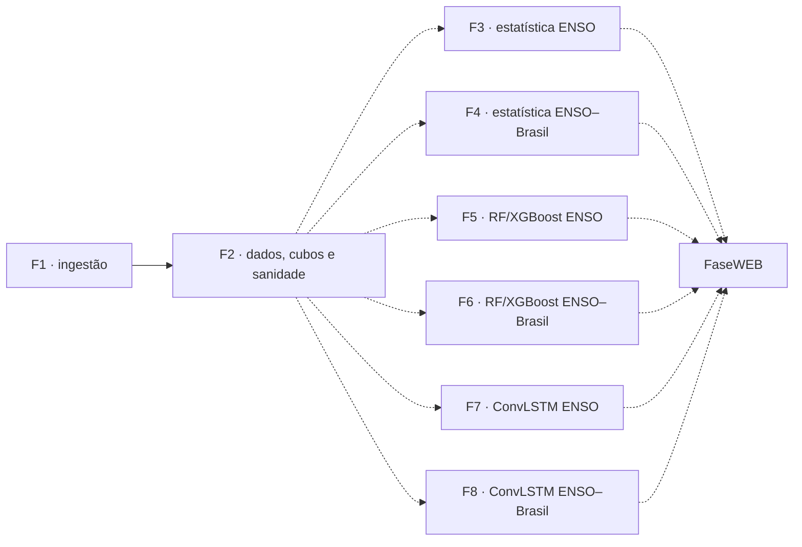

# NINO26

Pesquisa sobre gênese, crescimento, faixa de pico e decaimento de El Niño e La
Niña e sobre a distribuição espacial e temporal de sua relação com o clima do
Brasil.

## Regras de leitura

1. [Diretrizes das fases](docs/DIRETRIZES_FASES.md) — fonte canônica do escopo.
2. [Metodologia](docs/METODOLOGIA.md) — métodos permitidos por fase.
3. [Arquitetura](docs/ARQUITETURA.md) — organização de dados e outputs.
4. [Fontes de dados](docs/DATA_SOURCES.md) — inventário e procedência.
5. [Downloads](docs/RUNBOOK_DOWNLOADS.md) — obtenção e retomada dos dados.

## Princípio estrutural

As fases são independentes. Não existe sequência científica obrigatória, gate de
promoção ou influência automática entre elas. Todas podem usar os dados
disponibilizados por F1/F2. Herança e comparação entre fases são opcionais e
devem ser explicitadas.



## Fases

| Fase | Escopo independente |
|---|---|
| 1 | ingestão e base local |
| 2 | padronização, anomalias, matriz semanal, cubos, disponibilização e gráficos de sanidade no tempo |
| 3 | El Niño e La Niña por análises puramente estatísticas |
| 4 | relação estatística ENSO–Brasil, lags e distribuição espaço-temporal |
| 5 | RF/XGBoost para antecipar fases e faixa de pico do ENSO |
| 6 | RF/XGBoost para relação e distribuição espaço-temporal ENSO–Brasil |
| 7 | ConvLSTM para antecipar fases e faixa de pico do ENSO |
| 8 | ConvLSTM para distribuição espaço-temporal no Brasil |
| WEB | publicação, painel e operação recorrente da previsão antecipada da faixa de pico |

Lags e distribuição espacial/temporal são centrais somente nas Fases 4, 6 e 8.

## Definição NOAA do ENSO

O projeto usa OISST local em Niño 3.4 e segue a referência NOAA: média móvel de
três meses, limiar de `+0,5 °C` para El Niño ou `−0,5 °C` para La Niña, cinco
estações sobrepostas para um episódio histórico e confirmação de comportamento
atmosférico consistente. P90 não define El Niño e só pode aparecer com
fundamentação específica.

Fontes: [NOAA ENSO](https://www.climate.gov/enso) e
[NOAA CPC ONI](https://www.cpc.ncep.noaa.gov/products/analysis_monitoring/ensostuff/ONI_v5.php).

## Decisões fixas

- Usar sempre a expressão **faixa de pico**.
- Apresentar a base subsuperficial como **UFS+GLORYS**.
- Não atribuir importância prévia a D20, OHC, WWV, termoclina, SSH/SLA,
  temperatura, salinidade ou qualquer outra variável.
- Definir janelas móveis de acordo com o contexto, sem janela universal.
- Data augmentation: somente F5/F7 se necessário; F6/F8 ainda sem decisão.
- F2 deve incluir seção própria para validação CTD/WOD, TAO/TRITON e Argo.
- Alvos brasileiros usam pixels no tamanho original CHIRPS e representam extremo
  de chuva, chuva forte, chuva normal, estiagem e seca.
- Apresentações CHIRPS: pixel a pixel, regiões e biomas por região com shapefiles
  IBGE.

## Regra de ouro dos artefatos

Toda figura analítica nasce de uma tabela numérica.

- Imagens: `data/processed/figures/`.
- CSV/Parquet: `data/processed/numeric-tables/`.
- JSONs: `data/processed/metadata/` ou `data/audit/`.

## Regra básica das células Markdown

- Não usar cabeçalhos Markdown grandes (`#`, `##`, `###`) dentro dos notebooks.
- Títulos e subtítulos usam maiúsculas, **negrito** ou *itálico*.
- O primeiro notebook de cada fase começa, antes de **TÍTULO**, com o comando
  Bash/WSL2 para executar a fase inteira no terminal do VS Code.

Na raiz do projeto, cada fase possui um único comando:

```bash
make fase1
make fase2
make fase3
make fase4
make fase5
make fase6
make fase7
make fase8
```

## Ambiente e saúde local

```powershell
python -m venv .venv
.\.venv\Scripts\python -m pip install -r requirements.txt
.\.venv\Scripts\python -m pip install -e .
.\.venv\Scripts\python -m pytest -q
.\.venv\Scripts\python scripts\update_painel_executivo.py
```

## Git

Versione código, configurações, testes e documentação. Dados grandes permanecem
fora do Git. `git add .` é permitido, com revisão do diff antes do commit.
# Premissa de execução limpa e incremental

Antes de baixar, transformar ou publicar qualquer artefato, o programa deve
verificar o destino esperado. Um produto existente e íntegro é reutilizado sem
reescrita (`[skip]`). Somente produtos ausentes são criados; produtos derivados
presentes, mas inválidos ou incompletos, são reconstruídos individualmente. A
retomada não deve apagar nem recalcular produtos válidos. Os diretórios oficiais
`data/processed/figures/` e `data/processed/numeric-tables/` são recriados
automaticamente quando ausentes.
