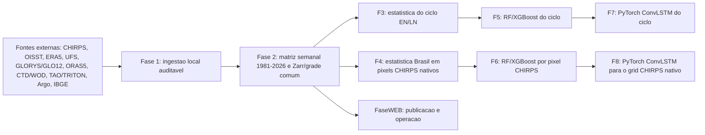

# NINO-BRASIL

Projeto Python para diagnosticar fisicamente o aquecimento do Pacifico equatorial
no Nino 3.4, organizar a matriz oceanografica/atmosferica semanal e avaliar a
teleconexao ENSO -> chuva no Brasil por fases auditaveis.

Este README e a porta de entrada do projeto. Os documentos longos ficam em
`docs/`; o status local vivo fica em `painel_executivo.md`.

## Leia Primeiro

| Necessidade | Arquivo | Uso |
|---|---|---|
| Fonte canonica das fases | [docs/DIRETRIZES_FASES.md](docs/DIRETRIZES_FASES.md) | Espinha dorsal atual: matriz 2x3 (Fases 1-8) - 3/5/7 mecanismo do ciclo (estatistica/ML/ConvLSTM), 4/6/8 distribuicao no Brasil (estatistica/ML/ConvLSTM); FaseWEB, gates e regras cientificas. Se houver divergencia, este documento prevalece. |
| Execucao auditavel F1-F8 | [docs/EXECUCAO_F1_F8.md](docs/EXECUCAO_F1_F8.md) | Comandos Git Bash por fase e notebook, pre-condicoes, smoke, oficial, validacao e gates. |
| Fase 3 cientifica recuperada | [Fase3-zero/README.md](Fase3-zero/README.md) | Snapshot congelado anterior a refatoracao, com 11 notebooks executados, figuras, numeric-tables e tabelas estatisticas preservadas. |
| Parecer de organizacao | [docs/PARECER_ORGANIZACAO_2026-07-09.md](docs/PARECER_ORGANIZACAO_2026-07-09.md) | Leitura curta do estado real do projeto, inconsistencias corrigidas e pendencias. |
| Cronograma operacional | [docs/CRONOGRAMA.md](docs/CRONOGRAMA.md) | Estado em disco e ordem de execucao Fase 2 -> Fase 4. |
| Status executivo local | [painel_executivo.md](painel_executivo.md) | Painel gerado automaticamente com cobertura de dados, lacunas e proximo comando recomendado. |
| Fluxo, metodos e outputs | [docs/ARQUITETURA.md](docs/ARQUITETURA.md) | Desenho executivo do pipeline, produtos numericos e fronteiras por fase. |
| Comandos de download | [docs/RUNBOOK_DOWNLOADS.md](docs/RUNBOOK_DOWNLOADS.md) | Sequencia operacional para CHIRPS, OISST, ERA5, oceano diario, CTD/WOD e validacao in situ. |
| Oceano originalmente diario | [docs/RUNBOOK_OCEAN_DAILY.md](docs/RUNBOOK_OCEAN_DAILY.md) | Fontes, contrato cientifico, numero de requisicoes e retomada UFS/GLORYS12. |
| Fechamento da Fase 2 oceanica | [docs/RUNBOOK_FASE2_OCEANO.md](docs/RUNBOOK_FASE2_OCEANO.md) | Execucao completa UFS, GLORYS/GLO12, ORAS5 mensal e auditorias. |
| Fase 3 fisica | [docs/FASE3_RECOMENDACOES.md](docs/FASE3_RECOMENDACOES.md) | Diagnostico fisico Nino 3.4 com OISST local, eventos derivados da propria SST, subsuperficie e Kelvin. |
| Metodologia cientifica | [docs/METODOLOGIA.md](docs/METODOLOGIA.md) | Regras de climatologia, anomalias, diagnosticos fisicos e auditoria. |
| Pico como faixa | [docs/PICO_FAIXA_BIBLIOGRAFIA.md](docs/PICO_FAIXA_BIBLIOGRAFIA.md) | Bibliografia e motivacao pratica para delimitar o pico do El Nino como janela (faixa), definicao adotada e saidas correspondentes. |
| Fontes de dados | [docs/DATA_SOURCES.md](docs/DATA_SOURCES.md) | Variaveis, dominios, caminhos de raw/interim/processed e politica de armazenamento. |
| Pareceres e paineis | [docs/PARECERES](docs/PARECERES) | Pareceres tecnicos recebidos e paineis descritivos derivados deles. |
| Documentos historicos | [docs/LEGADO](docs/LEGADO) | Escopo, plano diretor, arquitetura RN anterior e README operacional anterior. |

## Fluxo Em 30 Segundos



Regra de ouro do projeto: toda saida visual analitica gerada pelo projeto deve
nascer de uma saida numerica anterior, preferencialmente `Zarr` ou `CSV`.
Metadados JSON dessas saidas ficam em `data/processed/metadata/`, nunca nas
arvores limpas de `figures/` e `numeric-tables/`.
Graficos oficiais espelhados da NOAA/PSL podem ficar em `docs/assets` apenas
como comparativo visual, nunca como metrica, rotulo ou entrada do pipeline.

## Decisoes Fixas

| Tema | Decisao |
|---|---|
| Janela historica | CHIRPS/OISST/ERA5 desde `1981-01-01`; subsuperficie declara janelas reais por fonte e exige sensibilidade `1993+`/`2000+`. |
| Frequencia mestre | Semanal W-SUN para analise integrada; diaria para insumo bruto e diagnosticos especificos; mensal apenas para comparacao/calibracao. |
| Grades | Preditores podem ser harmonizados para comparação; o alvo CHIRPS de F4/F6/F8 mantém coordenadas e `pixel_id` nativos, sem interpolação. |
| Regioes principais | `nino34`, banda equatorial do Pacifico e Brasil/CHIRPS para teleconexao. |
| Chuva oficial | CHIRPS e insumo da Fase 4: teleconexao pixel-a-pixel, extremos/secas, P90 e lags semanais. Nao entra na Fase 3. |
| SST/SSTA principal | NOAA OISST diario baixado/local. |
| Indice ENSO | Eventos são derivados da SST/SSTA OISST local por critério simétrico: ONI local ≥ +0,5 °C (El Niño) ou ≤ −0,5 °C (La Niña) por pelo menos 5 estações móveis de 3 meses; intensidade usa a magnitude do extremo local. |
| Pico dos eventos | Faixa canônica contígua contendo o extremo e com magnitude >= 90% do extremo do evento; sensibilidade obrigatória em 80/90/95%. |
| Memoria subsuperficial | NOAA UFS 1981-1992 como ponte historica, GLORYS12 diario desde 1993 como fonte principal, GLO12 operacional na cauda; ORAS5 mensal independente. |
| Validacao in situ | CTD/WOD, TAO/TRITON e Argo validam D20/OHC/termoclina onde houver cobertura; nao substituem os cubos gridded. |
| Matriz semanal Fase 2 | `nino34_master_weekly.csv`: 17 variaveis oceanicas unificadas + 14 variaveis atmosfericas ERA5 + `ocean_source_code` como metadado de fonte. |
| Matriz de métodos | F3/F5/F7 comparam estatística/RF-XGBoost/ConvLSTM para o ciclo; F4/F6/F8 comparam os mesmos métodos para a resposta espacial no Brasil. |
| Unidade independente | Evento ENSO completo. Semanas, janelas e augmentation não aumentam o número de eventos e nunca cruzam folds. |
| Redes neurais | F7/F8 usam PyTorch ConvLSTM; F8 decodifica probabilisticamente para a forma nativa CHIRPS sem camada Dense por pixel. |
| Publicacao/operacao | **FaseWEB** concentra painel, publicacao e recalibracao recorrente. |

## Comandos Essenciais

Instalacao:

```powershell
python -m venv .venv
.\.venv\Scripts\python -m pip install --upgrade pip
.\.venv\Scripts\python -m pip install -r requirements.txt
.\.venv\Scripts\python -m pip install -e .
.\.venv\Scripts\python -m ipykernel install --user --name nino-brasil --display-name "Python 3.12 (.venv NINO26)"
```

Saúde local, sem iniciar cálculos oficiais longos:

```powershell
.\.venv\Scripts\python scripts\data_pipeline.py plan
.\.venv\Scripts\python scripts\data_pipeline.py status
.\.venv\Scripts\python scripts\build_master_weekly.py --validate-only --strict
.\.venv\Scripts\python scripts\verify_phase3_semantic_tables.py
.\.venv\Scripts\python scripts\validate_chirps_for_mirror.py
.\.venv\Scripts\python scripts\build_phase7_pacific_cube.py --validate-only
.\.venv\Scripts\python scripts\validar_notebooks.py --strict
.\.venv\Scripts\python -m pytest -q
.\.venv\Scripts\python scripts\update_painel_executivo.py
```

O fluxo completo mantem modos smoke/oficial e validacoes funcionais. As Fases
3, 4, 5 e 6 sao referencias historicas opcionais: F1/F2 podem alimentar
diretamente novas analises, F7/F8 ou outros modelos futuros.

O validador de figuras preserva a regra figura -> tabela. Metadados e manifests
JSON sao gravados fora das arvores de figuras e tabelas numericas.

Downloads longos e retomada ficam no runbook: [docs/RUNBOOK_DOWNLOADS.md](docs/RUNBOOK_DOWNLOADS.md).

## Politica De Arquivos

Versione codigo, configs, testes e documentacao. Nao versione dados grandes em
`data/raw/`, `data/interim/` ou `data/processed/`.

`painel_executivo.md` e local, gerado automaticamente e ignorado pelo Git. Ele
pode diferir entre maquinas porque reflete os dados disponiveis em cada
computador.

## Mapa Da Raiz

| Caminho | Papel |
|---|---|
| `src/nino_brasil/` | Biblioteca do projeto. |
| `scripts/` | Entrypoints operacionais de ingestão, curadoria, F1–F8, validação e painel. |
| `notebooks/fase2/` | Sanidade da matriz semanal e de todas as variaveis disponiveis. |
| `notebooks/fase3_nino/`, `notebooks/fase3_nina/` | Diagnósticos físicos separados de El Niño e La Niña. |
| `notebooks/fase4_nino/`, `notebooks/fase4_nina/` | Teleconexão por pixel CHIRPS separada para cada sinal. |
| `configs/project.yaml` | Fonte de verdade para dominios, grade e parametros principais. |
| `tests/` | Testes de features, saidas numericas e Zarr. |
| `docs/` | Documentacao organizada. |
| `papers/` | Artigos cientificos de apoio. |
| `data/` | Dados locais, geralmente nao versionados. |
