# NINO-BRASIL

Projeto Python para medir o peso relativo de variaveis oceanograficas e atmosfericas associadas ao aquecimento do Pacifico sobre anomalias diarias de precipitacao no Brasil.

Este README e a porta de entrada do projeto. Os documentos longos ficam em `docs/`; o status local vivo fica em `painel_executivo.md`.

## Leia Primeiro

| Necessidade | Arquivo | Uso |
|---|---|---|
| Status executivo local | [painel_executivo.md](painel_executivo.md) | Painel gerado automaticamente com cobertura de dados, lacunas e proximo comando recomendado. |
| Fluxo, metodos e outputs | [docs/ARQUITETURA.md](docs/ARQUITETURA.md) | Desenho executivo do pipeline, metodos, micro-metodos e proposito de cada produto. |
| Comandos de download | [docs/RUNBOOK_DOWNLOADS.md](docs/RUNBOOK_DOWNLOADS.md) | Sequencia operacional para CHIRPS, OISST, ERA5, oceano diario, CTD/WOD e validacao in situ. |
| Oceano originalmente diario | [docs/RUNBOOK_OCEAN_DAILY.md](docs/RUNBOOK_OCEAN_DAILY.md) | Fontes, contrato cientifico, numero de requisicoes e retomada UFS/GLORYS12. |
| Fechamento da Fase 2 oceanica | [docs/RUNBOOK_FASE2_OCEANO.md](docs/RUNBOOK_FASE2_OCEANO.md) | Execucao completa UFS, GLORYS/GLO12, ORAS5 mensal e auditorias. |
| Metodologia cientifica | [docs/METODOLOGIA.md](docs/METODOLOGIA.md) | Regras de climatologia, anomalias, validacao temporal, ablations e interpretabilidade. |
| Fontes de dados | [docs/DATA_SOURCES.md](docs/DATA_SOURCES.md) | Variaveis, dominios, caminhos de raw/interim/processed e politica de armazenamento. |
| Pareceres e paineis | [docs/PARECERES](docs/PARECERES) | Pareceres tecnicos recebidos e paineis descritivos derivados deles. |
| Documentos historicos | [docs/LEGADO](docs/LEGADO) | Escopo, plano diretor, arquitetura RN anterior e README operacional anterior. |

## Fluxo Em 30 Segundos

```mermaid
flowchart LR
    A["Fontes externas: CHIRPS, OISST, ERA5, NOAA UFS, GLORYS12, CTD/WOD, IBGE"] --> B["Fase 1: ingestao auditavel"]
    B --> C["Fase 2: Zarr diario e grade comum 0.25 grau"]
    C --> D["Fase 3: diagnosticos fisicos Nino 3.4"]
    D --> E["Fase 4: triagem estatistica"]
    E --> F["Fase 5A: progressao ate pico ENSO"]
    F --> G["Fase 5B: Nino3.4 para clusters de pixels no Brasil"]
    G --> H["Fase 6A: CNN espacial nativa NINO-BRASIL"]
    H --> I["Fase 6B: memoria espaco-temporal ate pico ENSO"]
    I --> J["Fase 6C: teleconexoes neurais e P90 Brasil"]
    J --> K["Fase 7: publicacao, operacao e painel"]
    K --> L["Fase 8: exploracao Ham2019 isolada"]
```



Regra de ouro do projeto: toda saida visual deve nascer de uma saida numerica anterior, preferencialmente `Zarr` ou `CSV`.

## Decisoes Fixas

| Tema | Decisao |
|---|---|
| Janela historica | `1981-01-01` ate o ultimo dado disponivel por fonte. |
| Frequencia mestre | Diaria. |
| Grade comum | `0.25` grau, definida em [configs/project.yaml](configs/project.yaml). |
| Regioes principais | `nino34` e `brazil`. |
| Chuva oficial | CHIRPS `p25`. |
| SST/SSTA principal | NOAA OISST diario. |
| Memoria subsuperficial | NOAA UFS diario (1981-1992), GLORYS12 diario (desde 1993), CTD/WOD e validacao TAO/TRITON/Argo. |
| Validacao de modelos | Blocos temporais, leave-one-event-out para picos ENSO e walk-forward; nao usar split aleatorio. |
| Anti-vazamento | Climatologia, desvio padrao e percentis sempre ajustados no treino de cada fold. |
| Fase 6 neural | Treinar modelos nativos NINO-BRASIL; CMIP6 fica apenas como fallback condicional de pre-treino/fine-tuning. |
| Fase 8 exploratoria | Testes Ham2019 ficam isolados da Fase 6, com pesos/dados externos apenas para compatibilidade, reproducao e comparacao exploratoria. |

## Comandos Essenciais

Instalacao:

```powershell
python -m venv .venv
.\.venv\Scripts\python -m pip install --upgrade pip
.\.venv\Scripts\python -m pip install -r requirements.txt
.\.venv\Scripts\python -m pip install -e .
```

Saude do projeto:

```powershell
.\.venv\Scripts\python scripts\data_pipeline.py plan
.\.venv\Scripts\python scripts\data_pipeline.py status
.\.venv\Scripts\python scripts\data_pipeline.py download-nino34-reference
.\.venv\Scripts\python scripts\data_pipeline.py build-nino34-daily-index
.\.venv\Scripts\python scripts\data_pipeline.py build-enso-peak-progression
.\.venv\Scripts\python scripts\update_painel_executivo.py
.\.venv\Scripts\python -m pytest -q
```

Downloads longos e retomada ficam no runbook: [docs/RUNBOOK_DOWNLOADS.md](docs/RUNBOOK_DOWNLOADS.md).

## Politica De Arquivos

Versione codigo, configs, testes e documentacao. Nao versione dados grandes em `data/raw/`, `data/interim/` ou `data/processed/`.

`painel_executivo.md` e local, gerado automaticamente e ignorado pelo Git. Ele pode diferir entre maquinas porque reflete os dados disponiveis em cada computador.

## Mapa Da Raiz

| Caminho | Papel |
|---|---|
| `src/nino_brasil/` | Biblioteca do projeto. |
| `scripts/` | Entrypoints operacionais de download, curadoria, modelagem e painel. |
| `configs/project.yaml` | Fonte de verdade para dominios, grade e parametros principais. |
| `tests/` | Testes de features, saidas numericas, Zarr e modelagem. |
| `docs/` | Documentacao organizada. |
| `papers/` | Artigos cientificos de apoio. |
| `data/` | Dados locais, geralmente nao versionados. |
