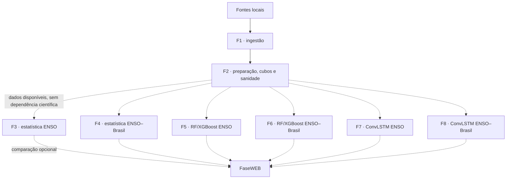

# Arquitetura NINO26

O projeto é uma coleção de estudos independentes sobre uma base compartilhada,
e não um pipeline linear com gates entre fases.

## Fronteiras

- F1 ingere e registra procedência.
- F1 também atualiza e audita as malhas IBGE de UFs, regiões e biomas.
- F2 trata, organiza e disponibiliza o estado mais recente recebido da F1, sem
  baixar fontes nem selecionar variáveis para outras fases.
- F2 publica cobertura, frescor por variável, sanidade temporal e validações no
  notebook F2Z.
- F3, F5 e F7 estudam o ciclo e a faixa de pico por métodos distintos.
- F4, F6 e F8 estudam lags e distribuição espaço-temporal no Brasil por métodos
  distintos.
- FaseWEB publica resultados identificando sua fase de origem.
- Nenhuma fase promove, bloqueia ou valida outra.

## Dados principais

- OISST: superfície e identificação oceânica Niño 3.4.
- UFS+GLORYS: subsuperfície, com fonte e período preservados internamente.
- ERA5: atmosfera.
- CHIRPS: alvos brasileiros em pixels no tamanho original.
- IBGE: regiões e biomas por shapefiles oficiais.
- CTD/WOD, TAO/TRITON e Argo: validação independente de UFS+GLORYS.

## Saídas

| Tipo | Local |
|---|---|
| figuras PNG/JPG | `data/processed/figures/` |
| tabelas CSV/Parquet | `data/processed/numeric-tables/` |
| metadados JSON | `data/processed/metadata/` ou `data/audit/` |
| cubos e matrizes de trabalho | `data/processed/` |

Figuras devem nascer de tabelas, mas JSONs não podem ser misturados às árvores de
figuras e tabelas.

## Execução

Cada fase possui entrada, configuração, runner, validação e outputs próprios.
Reutilização de produtos entre fases é opcional e deve ser declarada no run. O
fingerprint do código é informativo: sua alteração gera aviso, não invalidação
automática de runs históricos.
