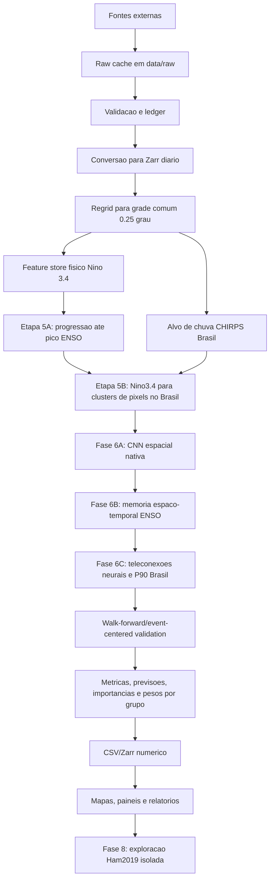
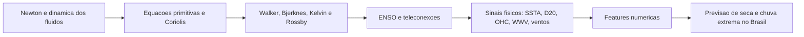

# Arquitetura Executiva, Metodos E Outputs

Este documento e o painel descritivo central do NINO-BRASIL. Ele mostra como o trabalho funciona, onde cada metodo entra e qual produto numerico ou visual ele gera.

## Fluxo Executivo

## Fluxo De Decisao Cientifica

No projeto, a fisica entra como pre-calculo interpretavel e como desenho de ablation. O pipeline atual nao resolve Navier-Stokes diretamente; ele usa variaveis observadas/reanalisadas que carregam essa dinamica fisica.

## Camadas Do Codigo

| Camada | Arquivos principais | Responsabilidade |
|---|---|---|
| Configuracao | `configs/project.yaml`, `src/nino_brasil/config.py` | Dominios, caminhos, grade comum e parametros globais. |
| Auditoria | `src/nino_brasil/data/audit.py`, `scripts/update_painel_executivo.py` | Registrar tarefas, resumir datasets e gerar painel local. |
| Downloads | `src/nino_brasil/data/download_*.py`, `scripts/data_pipeline.py` | Baixar fontes externas e controlar retomada. |
| Curadoria | `scripts/curate_and_resume_downloads.py` | Checar raw/Zarr/regrid e executar apenas pendencias. |
| Padronizacao | `src/nino_brasil/data/zarr_store.py`, `standardize.py`, `regrid.py`, `anomalies.py` | Converter, validar, regridar e calcular anomalias sem vazamento. |
| Features fisicas | `src/nino_brasil/features/*.py` | Indices ENSO, OHC, D20, WWV, tilt, tendencias, eventos e distribuicoes. |
| Modelagem | `src/nino_brasil/models/*.py`, `scripts/model_pipeline.py` | Construir matrizes, rodar walk-forward, calcular metricas e XAI. |
| Mapas | `src/nino_brasil/maps/*.py` | Exportar tabelas numericas antes de PNG. |
| Publicacao | `src/nino_brasil/web/build_site.py`, `docs/` | Material de documentacao e painel publico. |

## Metodos E Micro-Metodos

| Metodo | Micro-metodos | Mecanismo | Resultado |
|---|---|---|---|
| Ingestao auditavel | `download-chirps`, `download-oisst`, `download-era5`, `ocean_daily_pipeline.py`, `ocean_monthly_pipeline.py`, `download-ctd`, `download-validation` | Baixa por ano/variavel/regiao, preserva frequencia, respeita latencia e registra no ledger. | Raw cache e Zarr anual por fonte/frequencia. |
| Retomada segura | `curate_and_resume_downloads.py`, `validate_netcdf`, `validate_zarr` | Verifica o que ja existe, pula produtos validos e reexecuta pendencias. | Menos retrabalho e menor risco de sobrescrever produto valido. |
| Grade comum | `regrid-zarr`, `target_grid_from_config`, `normalize_for_common_grid` | Reprojeta os cubos para `0.25` grau antes da modelagem. | Cubos comparaveis em `data/processed/zarr/regridded/`. |
| Climatologia e anomalia | `fit_daily_climatology`, `daily_anomaly`, `fit_daily_standardization` | Ajusta estatisticas no treino de cada fold e aplica em validacao/teste. | Anomalias e z-scores sem vazamento temporal. |
| Eventos de chuva | `local_percentile_thresholds`, `event_mask` | Calcula P10, P25, P75 e P90 por pixel/local. | Classes seco extremo, seco moderado, umido moderado e umido extremo. |
| Sinal ENSO de superficie | `nino34_sst_index`, SSTA media/maxima, slope longitudinal | Resume o aquecimento do Pacifico equatorial e sua assimetria leste-oeste. | Indices diarios/mensais interpretaveis. |
| Memoria oceanica | `ocean_heat_content`, `warm_water_volume`, `ohc_tendency` | Integra calor subsuperficial e calcula tendencia temporal. | OHC, WWV e variacao de calor antes do pico do evento. |
| Termoclina | `d20_depth`, `thermocline_tilt`, `d20_tendency` | Estima profundidade da isoterma de 20 C, inclinacao e tendencia. | Diagnostico de acoplamento oceanico e fase do evento. |
| Acoplamento atmosfera-oceano | `wind_stress_curl`, `equatorial_zonal_stress`, ERA5 ventos | Extrai sinais de vento e rotacional associados a Walker/Bjerknes. | Features fisicas para ablation e XAI. |
| Tabela de eventos Nino 3.4 | `build_nino34_event_table`, `export_nino34_event_tables` | Consolida SSTA, slope, D20, OHC, duracao e fase mensal. | `nino34_event_table_monthly.csv` e `nino34_peak_comparison.csv`. |
| Distribuicoes | `diagnose-distributions` | Compara caudas com power law, lognormal e exponencial. | Diagnostico de extremos e recomendacao de distribuicao. |
| Serie diaria Nino 3.4 | `build-nino34-daily-index`, `nino34_sst_index` | Extrai do OISST diario a SSTA Nino 3.4, medias moveis, tendencias e duracao do sinal. | `nino34_daily_oisst.zarr` para aprender a trajetoria diaria. |
| Referencia oficial de picos | `download-nino34-reference` | Baixa o indice mensal NOAA PSL/ERSST v6 e deriva eventos/picos oficiais. | `noaa_psl_nino34_reference_peaks.zarr` para rotulos de pico. |
| Etapa 5A: progressao ate pico ENSO | `build_daily_enso_peak_progression_table` | Monta uma matriz evento-centrada diaria para aprender `future_peak_ssta`, `days_to_peak`, classe do pico e probabilidade de Super El Nino. | `enso_peak_progression.zarr` e metricas por horizonte diario/evento. |
| Etapa 5B: Nino3.4 -> clusters Brasil | `cluster_pixel_events`, `build_nino34_cluster_progression_table` | Agrupa pixels do Brasil por comportamento de eventos e aprende a progressao Nino3.4 -> taxa/probabilidade de evento por cluster. | `nino34_cluster_progression.zarr` e metricas por lag, cluster e evento. |
| Fase 6A: CNN espacial nativa | `phase_6_neural_event_progression_ai.stage_6a_native_enso_spatial_cnn` | Treina um encoder CNN espacial multihorizonte com inputs diarios NINO-BRASIL, picos NOAA PSL, OISST, ERA5 e oceano diario quando disponiveis, com janelas 90-540 dias. | `neural_6a_enso_cnn_training_runs.zarr` e `neural_6a_enso_cnn_predictions.zarr`. |
| Fase 6B: memoria espaco-temporal ENSO | `stage_6b_spatiotemporal_enso_memory_model` | Testa ConvLSTM, Temporal CNN ou 1D-Transformer para aprender rampa, aceleracao, persistencia, duracao acima de limiar, excedencia P90 de SSTA e progressao ate o pico. | `neural_6b_enso_memory_training_runs.zarr` e `neural_6b_enso_memory_predictions.zarr`. |
| Fase 6C: teleconexoes neurais Brasil | `stage_6c_brazil_cluster_neural_decoder` | Usa o estado latente ENSO de 6A/6B para prever probabilidade P10/P25/P75/P90 e anomalia de chuva por cluster de pixels no Brasil. | `neural_6c_brazil_cluster_predictions.zarr` e `neural_6c_brazil_cluster_p90_metrics.zarr`. |
| Fallback CMIP6 | `fallback_finetuning` | So entra se 6A/6B/6C nao baterem climatologia, persistencia e Fase 5; CMIP6 fica reportado como pre-treino/fine-tuning condicional. | Comparacao nativa vs CMIP6-pretrained sem misturar split aleatorio. |
| Fase 8: exploracao Ham2019 | `phase_8_ham2019_exploratory_benchmark` | Testa pesos salvos, tensores compativeis e limites de transferencia associados a Ham2019/reproducao, sempre fora da trilha principal da Fase 6. | `ham2019_exploratory_*` em Zarr/CSV, com relatorio separado. |
| Matriz de features legada | `build_predictor_matrix`, `align_target_to_predictor_matrix` | Alinha X(t) e Y(t+lag), com estrategia `mean` ou `flatten`, para comparacao contra o desenho evento-centrado. | Tabela de modelagem com lags de 7 a 168 dias. |
| Ablation | `PHASE2_ABLATIONS`, `PHYSICS_ABLATIONS` | Compara grupos de variaveis com e sem fisica pre-calculada. | Evidencia do peso relativo de oceano, atmosfera e fisica. |
| Walk-forward | `make_walk_forward_folds`, `run_walk_forward` | Treina no passado, valida no futuro proximo e testa no bloco seguinte. | Metricas, previsoes e comparacao com baselines. |
| Interpretabilidade | `permutation_importance_frame`, `shap_importance_frame`, pesos por grupo | Mede importancia por feature, metodo, grupo, lag e fold. | Ranking, SHAP, concordancia XAI e pesos fisicos. |
| Mapas | `export_pixel_table`, `export_choropleth_table`, plots PNG | Exporta CSV antes de renderizar figura. | Mapa visual rastreavel ate uma tabela numerica. |

## Outputs Principais

| Produto | Caminho esperado | Proposito |
|---|---|---|
| Ledger de auditoria | `data/audit/ledger.jsonl` | Provar o que foi tentado, baixado, validado ou falhou. |
| CHIRPS bruto | `data/raw/chirps/p25/` | Fonte diaria de precipitacao. |
| CHIRPS Zarr | `data/processed/zarr/brazil_precipitation/` | Cubo diario processado de chuva. |
| OISST Zarr | `data/processed/zarr/cpc_noaa/oisst/` | SST/SSTA diaria para ENSO. |
| ERA5 single-level | `data/processed/zarr/era5/single_levels/` | Variaveis atmosfericas de superficie. |
| ERA5 pressure-level | `data/processed/zarr/era5/pressure_levels/` | Estrutura vertical atmosferica. |
| NOAA UFS diario | `data/processed/zarr/ocean_daily/noaa_ufs/` | T(z), S(z) e SSH diarios nativos para a ponte 1981-1992. |
| GLORYS12 diario | `data/processed/zarr/ocean_daily/glorys12/` | T(z), S(z) e SSH medios diarios desde 1993, processados a 0,25 grau. |
| ORAS5 mensal | `data/processed/zarr/ocean_monthly/oras5/` | Memoria oceanica mensal independente; D20/OHC/SSH/SSS/T/S sem promocao diaria. |
| CTD/WOD | `data/processed/zarr/ctd_noaa/wod/` | Validacao vertical in situ da termoclina. |
| TAO/TRITON e Argo | `data/raw/tao_triton/`, `data/raw/argo/` | Validacao complementar no Pacifico equatorial. |
| Cubos regridados | `data/processed/zarr/regridded/` | Base harmonizada para comparar variaveis e treinar modelos. |
| Diagnostico de distribuicoes | `data/processed/zarr/distributions/`, `data/processed/parquet/distribution_diagnostics.csv` | Caracterizar extremos e caudas. |
| Feature store fisico | `data/processed/zarr/features/` | Sinais fisicos explicaveis antes da modelagem. |
| Tabela mensal Nino 3.4 | `data/processed/parquet/nino34_event_table_monthly.csv` | Responder perguntas numericas sobre eventos, picos e fases. |
| Comparacao de picos | `data/processed/parquet/nino34_peak_comparison.csv` | Comparar anos como 1997 e 2015 por SSTA, D20 e OHC. |
| Serie diaria OISST Nino 3.4 | `data/processed/zarr/features/nino34_daily_oisst.zarr` | Representar a evolucao diaria do aquecimento para o modelo 5A. |
| Picos oficiais NOAA PSL | `data/processed/zarr/features/noaa_psl_nino34_reference_peaks.zarr` | Rotular eventos/picos sem depender de lista manual. |
| Progressao ate pico ENSO | `data/processed/zarr/modeling/enso_peak_progression.zarr` | Treinar o modelo A para reconhecer trajetorias ate El Nino forte/Super El Nino. |
| Progressao Nino3.4-clusters Brasil | `data/processed/zarr/modeling/nino34_cluster_progression.zarr` | Treinar o modelo B para ligar fase/intensidade do Nino3.4 a eventos por clusters de pixels no Brasil. |
| Fase 6A CNN ENSO | `data/processed/zarr/modeling/neural_6a_enso_cnn_predictions.zarr` | Baseline neural nativo para pico ENSO, dias ate pico e Super El Nino. |
| Fase 6B memoria ENSO | `data/processed/zarr/modeling/neural_6b_enso_memory_predictions.zarr` | Modelo temporal para progressao nao linear, persistencia, P90 de SSTA e memoria fisica. |
| Fase 6C clusters Brasil | `data/processed/zarr/modeling/neural_6c_brazil_cluster_predictions.zarr` | Probabilidades P10/P25/P75/P90 e anomalia de chuva por cluster de pixels. |
| Fase 8 Ham2019 pesos | `data/raw/external/ham2019_reproduction_weights/` | Referencia local para exploracao isolada de pesos/dados Ham2019; nao entra na Fase 6. |
| Fase 8 Ham2019 resultados | `data/processed/zarr/modeling/ham2019_exploratory_*` | Compatibilidade, inferencia congelada, skill exploratorio e limites de transferencia. |
| Metricas walk-forward | `data/processed/zarr/modeling/walk_forward_metrics.zarr` | Avaliar habilidade dos modelos por lag, evento, regiao e estacao. |
| Previsoes walk-forward | `data/processed/zarr/modeling/walk_forward_predictions.zarr` | Guardar y_true, y_pred, data alvo e contexto do fold. |
| Importancias | `data/processed/zarr/modeling/walk_forward_importances.zarr` | Explicar quais variaveis sustentaram cada previsao. |
| Pesos por grupo | `data/processed/zarr/modeling/walk_forward_group_weights.zarr` | Medir peso relativo de oceano, atmosfera e fisica pre-calculada. |
| Resumos tabulares | `data/processed/parquet/modeling/*.csv` | Leitura rapida para relatorio, painel e revisao. |
| Mapas | `docs/assets/maps/` | Figuras derivadas de CSV/Zarr, nunca como produto unico. |
| Painel executivo | `painel_executivo.md` | Estado local de dados, riscos e proximos passos. |

## Ordem Operacional Recomendada

1. Rodar `scripts\data_pipeline.py plan` para conferir a ordem.
2. Rodar downloads e curadoria pelo [runbook](RUNBOOK_DOWNLOADS.md).
3. Atualizar `painel_executivo.md` com `scripts\update_painel_executivo.py`.
4. Fechar lacunas de dados antes de modelar.
5. Regridar cubos para a grade comum.
6. Gerar features fisicas e tabelas de eventos.
7. Rodar pre-analises estatisticas.
8. Baixar a referencia mensal NOAA PSL de picos Nino 3.4.
9. Gerar a serie diaria OISST Nino 3.4/SSTA.
10. Gerar a matriz 5A de progressao ate pico ENSO.
11. Gerar a matriz 5B Nino3.4 -> clusters de pixels no Brasil.
12. Rodar `scripts\model_pipeline.py` ou equivalente evento-centrado com walk-forward/leave-one-event-out.
13. Treinar a Fase 6A como baseline CNN espacial nativo, sem depender dos pesos externos.
14. Treinar a Fase 6B para memoria espaco-temporal e progressao ate o pico ENSO.
15. Treinar a Fase 6C para teleconexoes neurais por clusters de pixels e eventos `P90`.
16. Acionar CMIP6/fine-tuning apenas se 6A/6B/6C nao superarem os gates definidos.
17. Gerar CSV/Zarr de resultados.
18. Renderizar mapas e paineis a partir dos arquivos numericos.
19. Rodar a Fase 8 Ham2019 apenas como exploracao separada de pesos/dados externos, com relatorio proprio.

## Regra De Interpretacao

Uma figura so entra no trabalho se houver um arquivo numerico anterior capaz de responder a mesma pergunta sem depender de cor no mapa. Isso vale para pixel maps, choropleths, metricas, XAI e comparacoes historicas de eventos.
