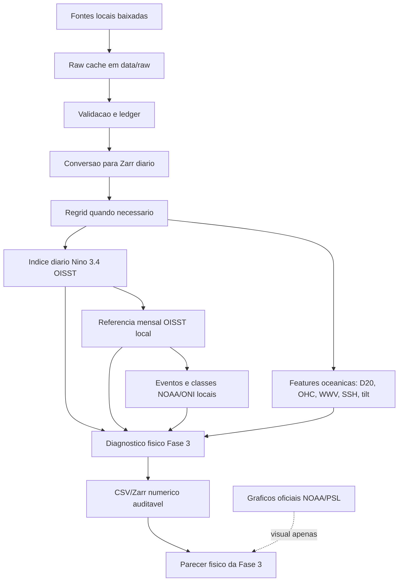

# Arquitetura Ativa NINO-BRASIL

Este documento descreve o fluxo ativo do projeto apos a revisao de escopo: o
trabalho para na Fase 3, usa SST/SSTA OISST local como fonte de verdade para o
Nino 3.4 e nao executa rotulo ENSO externo, ML ou redes neurais. Graficos
oficiais NOAA/PSL do Nino 3.4 sao preservados somente como comparativo visual.

## Fluxo Executivo



## Decisoes De Arquitetura

| Tema | Decisao |
|---|---|
| Fonte ENSO | `NOAA OISST v2.1` diario baixado/local. |
| Rotulo ENSO externo | Fora das metricas. Eventos, referencia mensal, ONI local e classes NOAA/ONI saem da OISST baixada. |
| Graficos oficiais Nino 3.4 | Mantidos em `docs/assets/figures/official_nino34/` para comparativo visual, excluidos de metricas, eventos e diagnosticos. |
| Eventos | Derivados de `nino34_daily_oisst.csv` por agregacao mensal local: media movel de 3 meses >= +0,5 C por 5 estacoes moveis sobrepostas. |
| Intensidade | Pico ONI local: fraco [0,5;1,0), moderado [1,0;1,5), forte [1,5;2,0), muito_forte >= 2,0 C. |
| Escopo | Encerrar em Fase 3: diagnostico fisico do Pacifico/Nino 3.4. |
| ML/modelagem | Fora do escopo ativo. |
| Saida visual | Figuras analiticas do projeto precisam nascer de CSV/Zarr numerico; graficos oficiais espelhados sao referencia externa visual. |

## Comandos Ativos

```powershell
.\.venv\Scripts\python scripts\data_pipeline.py build-nino34-daily-index
.\.venv\Scripts\python scripts\data_pipeline.py build-nino34-sst-reference
.\.venv\Scripts\python scripts\data_pipeline.py sync-official-nino34-visuals
.\.venv\Scripts\python scripts\data_pipeline.py build-phase3-diagnostics
.\.venv\Scripts\python scripts\data_pipeline.py audit-phase3-diagnostics
.\.venv\Scripts\python scripts\fase3_build_inputs.py --force
```

## Produtos Principais

| Produto | Caminho |
|---|---|
| Serie diaria Nino 3.4 OISST | `data/processed/parquet/features/nino34_daily_oisst.csv` |
| Store diario Nino 3.4 OISST | `data/processed/zarr/features/nino34_daily_oisst.zarr` |
| Referencia mensal OISST local | `data/processed/parquet/features/nino34_monthly_oisst.csv` |
| Eventos OISST locais | `data/processed/parquet/features/nino34_oisst_event_reference.csv` |
| Graficos oficiais Nino 3.4, visual apenas | `docs/assets/figures/official_nino34/` |
| Sinal fisico diario | `data/processed/parquet/features/nino34_physical_signal.csv` |
| Diagnostico termoclina/OHC/WWV | `data/processed/zarr/features/nino34_thermocline_diagnostics.zarr` |
| Comparacao de picos fisicos | `data/processed/parquet/features/nino34_peak_comparison.csv` |
| Auditoria da Fase 3 | `data/audit/phase3_diagnostics_audit.json` |

## Regra De Interpretacao

Uma figura analitica gerada pelo projeto so entra no trabalho se houver um
arquivo numerico anterior capaz de responder a mesma pergunta sem depender de
cor no mapa. Graficos oficiais espelhados sao permitidos como comparativo visual
e precisam ser citados como externos, sem alimentar metricas. O produto final
esperado e um parecer fisico auditavel da Fase 3, nao um modelo preditivo.
