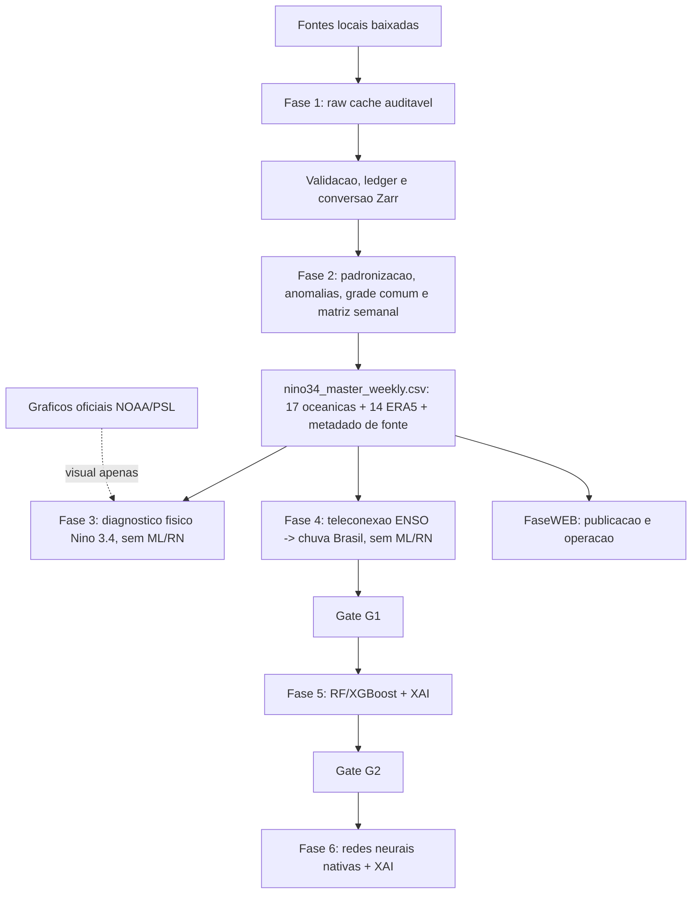

# Arquitetura Ativa NINO-BRASIL

Este documento descreve o fluxo ativo apos a reorganizacao de 2026-07-09. A
fonte canonica das fases e `docs/DIRETRIZES_FASES.md`; quando algum documento
historico divergir, prevalece a diretriz canonica.

## Fluxo Executivo



## Decisoes De Arquitetura

| Tema | Decisao |
|---|---|
| Fonte ENSO | `NOAA OISST v2.1` diario baixado/local. |
| Rotulo ENSO externo | Fora das metricas. Eventos, referencia mensal, ONI local e classes NOAA/ONI saem da OISST baixada. |
| Graficos oficiais Nino 3.4 | Mantidos em `docs/assets/figures/official_nino34/` para comparativo visual, excluidos de metricas, eventos e diagnosticos. |
| Eixo integrado | Semanal W-SUN. Dados mensais sao apenas comparacao/calibracao. |
| Fase 2 | Disponibiliza todas as variaveis baixadas com serie temporal auditavel, principalmente para uso semanal 1981-2026. |
| Fase 3 | Caracteriza o Pacifico/Nino 3.4: eventos EN/LN, duracao, genese, crescimento, pico, decaimento, Hovmoller, Bjerknes, Kelvin, mapas, PCA/EOF e estatistica. Sem ML/RN. |
| Fase 4 | Avalia teleconexao ENSO -> chuva Brasil com CHIRPS, pixel-a-pixel, P90 do periodo de aquecimento, anomalias de chuva, lags semanais, N_eff e FDR. Sem ML/RN. |
| Fase 5 | Repite o estudo da Fase 4 com Random Forest e XGBoost + XAI, se G1 justificar. |
| Fase 6 | Redes neurais nativas + XAI, apenas se vencer climatologia, persistencia, Fase 4 e Fase 5. |
| FaseWEB | Publicacao, painel e operacao recorrente. |
| Saida visual | Figuras analiticas do projeto precisam nascer de CSV/Zarr numerico; graficos oficiais espelhados sao referencia externa visual. |

## Comandos Ativos

```powershell
.\.venv\Scripts\python scripts\build_master_weekly.py --era5-years 1981:2026
.\.venv\Scripts\python scripts\fase3_build_inputs.py --force
.\.venv\Scripts\python -m jupyter nbconvert --to notebook --execute --inplace --allow-errors --ExecutePreprocessor.timeout=7200 notebooks\fase2\2Z_sanidade_variaveis.ipynb
.\.venv\Scripts\python scripts\run_fase3_all.py
.\.venv\Scripts\python scripts\run_fase4_all.py
.\.venv\Scripts\python scripts\update_painel_executivo.py
```

## Produtos Principais

| Produto | Caminho |
|---|---|
| Matriz semanal Nino 3.4 | `data/processed/parquet/features/nino34_master_weekly.csv` |
| Auditoria da matriz semanal | `data/processed/parquet/statistics/phase2_master_audit.csv` |
| Validacao da matriz semanal | `data/processed/parquet/statistics/phase2_master_validation.csv` |
| Validacao CTD/WOD | `data/processed/parquet/statistics/phase2_ctd_validation.csv` |
| Serie diaria Nino 3.4 OISST | `data/processed/parquet/features/nino34_daily_oisst.csv` |
| Referencia mensal OISST local | `data/processed/parquet/features/nino34_monthly_oisst.csv` |
| Eventos OISST locais | `data/processed/parquet/features/nino34_oisst_event_reference.csv` |
| Sinal fisico diario | `data/processed/parquet/features/nino34_physical_signal.csv` |
| Diagnostico termoclina/OHC/WWV | `data/processed/zarr/features/nino34_thermocline_diagnostics.zarr` |
| Auditoria da Fase 3 | `data/audit/phase3_diagnostics_audit.json` |
| Saidas Fase 3 | `data/processed/parquet/statistics/` e `data/processed/figures/fase3/` |
| Saidas Fase 4 | `data/processed/parquet/statistics/` e `data/processed/figures/fase4/` |

## Regra De Interpretacao

Uma figura analitica gerada pelo projeto so entra no trabalho se houver um
arquivo numerico anterior capaz de responder a mesma pergunta sem depender de
cor no mapa. Graficos oficiais espelhados sao permitidos como comparativo visual
e precisam ser citados como externos, sem alimentar metricas.
